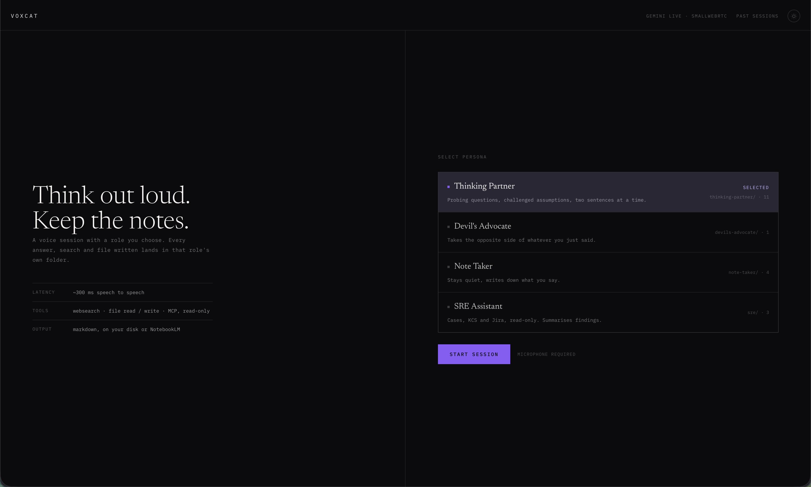
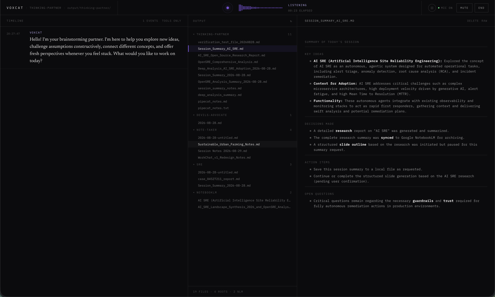
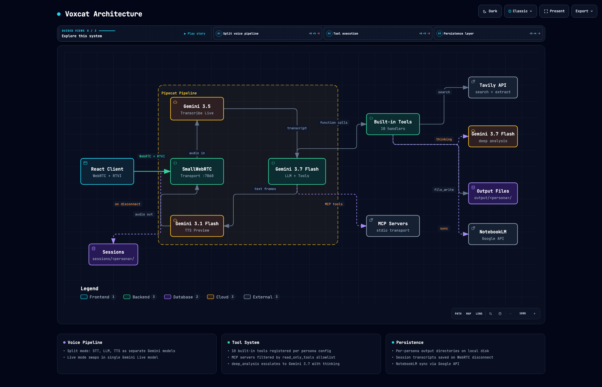

# Voxcat

A voice AI agent with swappable personas. Talk to it, it calls tools, writes files, and remembers what you discussed.

Built on [Pipecat](https://github.com/pipecat-ai/pipecat) + Gemini Live + SmallWebRTC.







## What it does

- **Voice-first**: speak naturally, get spoken responses
- **Personas**: switch roles (Thinking Partner, Devil's Advocate, Note Taker, SRE Assistant) with different instructions and tool sets
- **10 built-in tools**: web search, web read, file read/write/list, deep analysis (Gemini 3.7 Flash), research, session summary, NotebookLM sync, current time
- **MCP integration**: connect external tool servers (Red Hat API, Jira) with read-only enforcement
- **Per-persona output**: each persona writes to its own folder
- **Session continuity**: past sessions saved as markdown, continue any session with full context injected

## Architecture

Two pipeline modes, configurable in `config.yaml`:

```
Live mode (~300ms latency):
  mic -> Gemini 3.1 Flash Live (STT+LLM+TTS) -> speaker

Split mode (~800ms, smarter):
  mic -> Gemini 3.5 Transcribe Live (STT)
       -> Gemini 3.6 Flash (LLM + tools)
       -> Gemini 3.1 Flash TTS -> speaker
```

Frontend connects via WebRTC. RTVI data channel carries transcripts and tool call events.

## Quick start

```bash
# Prerequisites: Python 3.13+, uv

# Option A: install as a tool
uv tool install git+https://github.com/judexzhu/voxcat
voxcat init              # creates ~/.config/voxcat/config.yaml + .env
# Edit ~/.config/voxcat/.env: GOOGLE_API_KEY (required), TAVILY_API_KEY (optional)
voxcat                   # start server on :7860
# Output files go to ~/Documents/voxcat/

# Option B: clone and run
git clone https://github.com/judexzhu/voxcat && cd voxcat
./setup.sh
# Edit .env: GOOGLE_API_KEY (required), TAVILY_API_KEY (optional)
uv run voxcat            # start server on :7860

# Dev (with hot reload — requires Node 20+)
cd client && npm run dev   # frontend on :5173
uv run voxcat              # backend on :7860
```

Open `http://localhost:7860`, select a persona, start talking.

## Configuration

All in `config.yaml`:

```yaml
voice:
  mode: "live"                              # or "split"
  live_model: "gemini-3.1-flash-live-preview"
  split:
    stt_model: "gemini-3.5-transcribe-live"
    llm_model: "gemini-3.6-flash"
    tts_model: "gemini-3.1-flash-tts-preview"
    tts_voice: "Kore"                       # Puck, Charon, Kore, Fenrir, Aoede
    tts_pace: "fast"                        # slow, fast, or remove for default

persona:
  default: "thinking-partner"
  profiles:
    thinking-partner: { instruction, tools, output directory }
    devils-advocate: { ... }
    note-taker: { ... }
    sre: { ..., mcp_servers: [redhat, jira] }
```

## UI

Custom React client with the "Instrument Panel" design:

- **Top rail**: wordmark, persona label, voice instrument (6 states), mic controls, theme toggle
- **Timeline**: timestamped transcript with inline tool events, 4 result treatments (results list, prose, status, raw JSON)
- **Output tree**: collapsible per-persona folders + NotebookLM sources, rename/delete files
- **Document preview**: rendered markdown with GFM tables, RAW toggle
- **Past sessions**: browse, preview, rename, delete, continue with context injection
- **Real audio meter**: 32-bar visualizer driven by AnalyserNode on mic stream
- **Dark/light themes**: CSS custom property swap, persisted to localStorage

## Project structure

```
src/voxcat/
  cli.py            CLI entry point, HTTP routes, server startup
  bot.py            Pipeline orchestrator (live + split modes)
  tools.py          10 tool handlers + build_tools() registry
  transcript.py     TranscriptRecorder (output + session files)
  mcp_connect.py    MCP server connection with read-only filter
  filestore.py      safe_resolve() for path traversal prevention

client/src/
  App.tsx            Landing page, session view, past sessions
  components/
    VoiceInstrument  6-state ring + meter + status label
    ActivityPanel    Timeline with auto-scroll + TOOLS ONLY filter
    ToolResultCard   4 result treatments (results, prose, status, raw)
    OutputTree       Collapsible folders + NotebookLM group
    FilePreview      Markdown preview + RAW + rename/delete
    PersonaSelector  Landing page persona rows with descriptions
  hooks/
    useActivityLog   RTVI event subscription (transcript + tool events)
    useAudioLevel    AnalyserNode mic visualization
```

## Environment variables

| Variable | Required | Purpose |
| --- | --- | --- |
| `GOOGLE_API_KEY` | Yes | Gemini Live, Flash, TTS, Transcribe |
| `TAVILY_API_KEY` | No | Web search + web read tools |
| `NOTEBOOKLM_NOTEBOOK_ID` | No | Sync documents to NotebookLM |
| `RH_API_OFFLINE_TOKEN` | No | Red Hat API MCP server |
| `JIRA_SERVER_URL` | No | Jira MCP server |
| `JIRA_API_TOKEN` | No | Jira MCP server |
| `JIRA_USER_EMAIL` | No | Jira MCP server |

## License

[AGPL-3.0](LICENSE) — free to use, modify, and distribute. If you run a modified version as a network service, you must open-source your changes.
